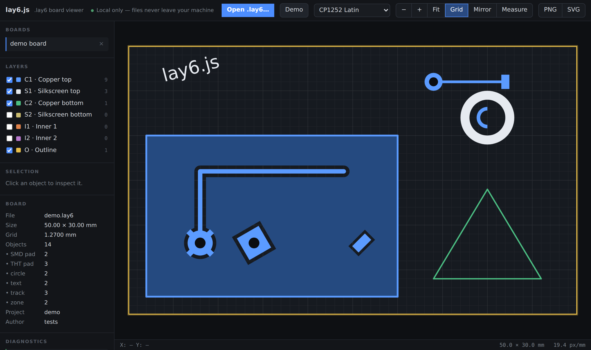

<div align="center">


# lay6.js

### A fast, private, browser‑only viewer for Sprint‑Layout 6 `.lay6` PCB files

Open the page, drop a board, read it. No install, no backend, **nothing ever leaves your machine.**

<p>
  <a href="https://mvrer.github.io/lay6.js/"></a>
  
  
  
</p>



</div>

---

> [!IMPORTANT]
> **Your files never leave your machine.** There is no server, no upload, no
> analytics, and no external requests. Boards are read with the browser's
> `FileReader` API and parsed entirely in local JavaScript. The page works
> **offline** once cached, and runs straight from `file://` if you just open
> `index.html` from a checkout.

> [!NOTE]
> **Unofficial.** This project is not affiliated with, endorsed by, or connected
> to ABACOM. It reads files produced by their layout software based on
> independent format research, and is **not a manufacturing reference** — copper
> zone fills, clearances, and thermal reliefs are approximated for on‑screen
> viewing only.

## Why it looks right

Real boards are dense. lay6.js is tuned so a loaded board reads clearly instead
of turning into a wall of colour:

- **Copper pours are a muted wash**, drawn *under* the bright tracks and pads, so
  a trace crossing a ground plane stays visible instead of vanishing into a slab
  of the same colour.
- **Traces and pads are outlined** (a dark "casing"), so touching or densely
  packed copper reads as separate shapes instead of merging into one blob — and
  hovering any conductor lights up its whole connected net to follow a route.
- **Every layer has its own high‑contrast tone** on a dark canvas — copper,
  silkscreen, inner and outline layers never blur together.
- **Cyrillic (and other) text is auto‑detected.** A board authored in a Russian
  ANSI codepage (CP1251) is decoded correctly *on load* — no need to hunt for an
  encoding menu first. You can still override it if a file guesses wrong.

## Features

| | |
|---|---|
| 🗂️ **Multi‑board** | Drag‑and‑drop or file picker; multi‑board files open as tabs |
| 🔍 **Smooth navigation** | Wheel zoom, drag pan, pinch zoom, fit‑to‑board, double‑click to reset |
| 🪞 **Mirror & rotate** | Flip horizontally to read the bottom side (copper‑side boards auto‑mirror); rotate in 90° steps to fix boards that load sideways or upside down |
| 🎨 **Per‑layer control** | Visibility toggles with live object counts; the file's own visibility flags apply on load |
| 🟫 **Copper zones** | Ground‑distance clearance subtracted around same‑layer pads/tracks, thermal‑relief spokes, cutoff isolation |
| ⭕ **Arcs & rings** | Annular rings and partial arcs rendered from their true start/end angles |
| 🔗 **Net highlight** | Hover a track or pad to light up its whole connected net, with a tooltip naming nearby silkscreen labels |
| 🔎 **Inspector** | Click any object for position, size, drill, rotation, net and clearance |
| 📏 **Measure** | Live cursor read‑out in mm and a two‑click distance tool |
| 🌐 **Encoding aware** | Auto‑detects CP1251 Cyrillic; manual CP1252 / CP1251 / CP1250 override re‑decodes instantly, no reparse |
| 🖼️ **Export** | Save the current view to PNG or SVG |
| ⚠️ **Honest errors** | Specific messages for bad signatures, truncation and implausible counts — never a silent blank canvas |
| 🩹 **Resilient parsing** | If one board (or an unhandled format quirk) fails to decode, the boards that *did* parse still render, with a diagnostic pinpointing exactly where it broke |

### Keyboard

| Key | Action | | Key | Action |
|---|---|---|---|---|
| <kbd>F</kbd> | fit board | | <kbd>+</kbd> / <kbd>−</kbd> | zoom |
| <kbd>X</kbd> | mirror view | | <kbd>←↑↓→</kbd> | pan |
| <kbd>R</kbd> | rotate 90° (<kbd>Shift</kbd> reverses) | | <kbd>1</kbd>…<kbd>7</kbd> | toggle a layer |
| <kbd>M</kbd> | measure tool | | <kbd>G</kbd> | toggle grid |
| | | | <kbd>Esc</kbd> | cancel / deselect |

## Correctness

The parser treats **full‑buffer consumption as a hard invariant**: after reading
the trailer it checks that the read position equals the file size, and any
mismatch is surfaced in the Diagnostics panel. If a board renders, every byte of
the file was accounted for.

<details>
<summary><b>Documented format assumptions</b> (where the research is ambiguous)</summary>

<br>

- angles (arc start/end, rotation) are stored in 1/1000 degree
- coordinates and widths are stored in 1/10000 mm
- the y origin is the board's bottom‑left corner, so board content spans
  `-size_y..0`; the viewer shifts by the board height when drawing
- text objects carry their glyph strokes as child track objects; the string
  itself is only drawn (approximated with a browser font) when a text object has
  no children
- an SMD pad's corner polygon (its point list) is authoritative for its position
  and shape; the record's x/y anchor is frequently stale in real files and is
  only used when no points are present
- the board grid field is stored in micrometres
- connection blocks follow the board's objects, one per THT/SMD pad in document
  order, including pads inside components
- net highlighting is computed geometrically (touching copper on the same layer,
  through‑hole pads bridging layers); it approximates connectivity for reading,
  not for electrical verification
- the text codepage is not stored in the file; it is auto‑detected (Cyrillic
  CP1251 vs Latin CP1252) and can be overridden in the toolbar

</details>

> Boards made for the classic single‑sided toner‑transfer workflow are often
> drawn as seen from the copper side, so their text appears mirrored. That is
> faithful to the file — use **Mirror** to read it (it is enabled automatically
> when detected).

## Running locally

No build step, no dependencies. Either:

- open `index.html` directly from the checkout, or
- serve the directory with any static file server (e.g. `python3 -m http.server`).

## Tests

```sh
npm test                     # node --test test/*.test.js  (needs Node 18+)
node test/make-fixtures.js   # regenerates the committed fixtures
```

Fixtures are produced by a small synthetic `.lay6` generator
(`test/genlay6.js`), so the repository never has to contain anyone's real design
files. The suite asserts full‑buffer consumption, board dimensions, object‑type
histograms, string re‑decoding, encoding auto‑detection, and that each failure
mode (bad magic, truncation, absurd counts) yields its specific error.

## Contributing

This is a personal project. To keep commit messages free of tool‑generated
attribution trailers, enable the bundled hook once per clone:

```sh
git config core.hooksPath .githooks
```

## Credits

The binary layout of the `.lay6` format was understood with the help of the
independent reverse‑engineering research published at
[sergey-raevskiy/xlay](https://github.com/sergey-raevskiy/xlay), used strictly as
a research reference — no code or headers from that repository are included here.

## License

[MIT](LICENSE)
